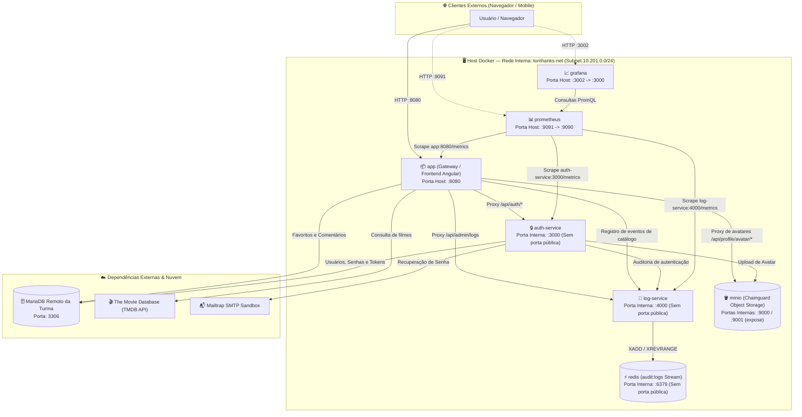

# Catálogo de Filmes — Tom Hanks 🎬

> Desenvolvido para a disciplina **ISW055 – Introdução à Computação em Nuvem**  
> Faculdade de Tecnologia de Pompeia (Fatec Pompeia)  
> Professor: [@siriani](https://github.com/siriani)

---

## 📌 Visão Geral do Projeto

O **Catálogo de Filmes do Tom Hanks** é uma aplicação completa baseada em arquitetura de microsserviços distribuídos em containers Docker, projetada para execução tanto em ambiente local de desenvolvimento quanto em orquestração de produção via **Portainer**.

A solução integra consumo dinâmico da API da TMDB (The Movie Database), autenticação desacoplada, controle de acesso baseado em papéis (RBAC), auditoria de eventos em alta performance com Redis Streams, armazenamento de mídia em Object Storage S3 compatível (MinIO), telemetria completa com Prometheus e Grafana, e pipeline de CI/CD automatizado com GitHub Actions e Container Registry (GHCR).

---

## 🏛️ Arquitetura do Sistema

Todos os serviços comunicam-se de forma isolada através de uma rede bridge dedicada `tomhanks-net` com endereçamento CIDR fixo (`10.201.0.0/24`), sem uso de `container_name` para permitir escalabilidade e padronização pelo nome do serviço. O serviço `app` atua como **Gateway da Aplicação** e único ponto de entrada para o tráfego do usuário.



---

## 🔌 Tabela de Serviços e Portas

| Serviço | Container / Imagem | Porta Interna | Porta Publicada no Host | Exposição Pública | Finalidade |
|---|---|---|---|---|---|
| **app** | Build (`Dockerfile`) | 8080 | `${PORT:-8080}:8080` | **Sim** (Público) | Gateway reverso, API do catálogo e arquivos do frontend Angular |
| **auth-service** | Build (`Dockerfile.auth`) | 3000 | *Nenhuma* | **Não** (Interno) | Microsserviço de autenticação, sessões, RBAC e perfil |
| **log-service** | Build (`Dockerfile.log`) | 4000 | *Nenhuma* | **Não** (Interno) | Microsserviço de auditoria com persistência em Redis Streams |
| **redis** | `redis:7-alpine` | 6379 | *Nenhuma* | **Não** (Interno) | Base de dados em memória para streams de log com persistência AOF |
| **minio** | `cgr.dev/chainguard/minio:latest` | 9000, 9001 | *Nenhuma* (`expose: 9000, 9001`) | **Não** (Interno) | Object Storage S3 para fotos de perfil dos usuários |
| **prometheus** | Build (`Dockerfile.prometheus`) | 9090 | `9091:9090` | **Sim** (Monitoramento) | Raspagem e armazenamento de séries temporais de métricas |
| **grafana** | Build (`Dockerfile.grafana`) | 3000 | `3002:3000` | **Sim** (Dashboards) | Interface gráfica de métricas com dashboards pré-provisionados |
| **MariaDB** | Nuvem externa | 3306 | Remoto | Conexão Externa | Banco de dados relacional oficial da turma |

---

## 🚀 Como Executar

### 1. Execução Local via Docker Compose

#### Pré-requisitos
- Docker Engine e Docker Compose instalados.
- Conectividade com a internet (para download de imagens e acesso ao MariaDB remoto).

#### Passo a passo
1. Clone o repositório:
   ```bash
   git clone https://github.com/JoaoVSerrano/tomhanks.git
   cd tomhanks
   ```
2. Crie o arquivo `.env` a partir do modelo de exemplo:
   ```bash
   cp .env.example .env
   ```
3. Preencha as variáveis de ambiente obrigatórias no `.env` (banco de dados, chaves secretas e credenciais do MinIO).
4. Suba todos os containers com build automatizado:
   ```bash
   docker compose up -d --build
   ```
5. Acesse os serviços no navegador:
   - **Catálogo Web**: `http://localhost:8080`
   - **Swagger UI Interativo**: `http://localhost:8080/apidocs`
   - **Métricas Prometheus**: `http://localhost:9091`
   - **Dashboards Grafana**: `http://localhost:3002` (Login: `admin` / senha configurada em `GRAFANA_ADMIN_PASSWORD`)

---

### 2. Deploy no Portainer

No Portainer, a stack é criada diretamente a partir do repositório Git ou colando o arquivo `docker-compose.yml`. Como o arquivo `.env` está no `.gitignore` por segurança e não existe dentro do container do Portainer, **todas as variáveis obrigatórias devem ser declaradas no painel da stack**:

1. Acesse o **Portainer** → **Stacks** → **Add stack**.
2. Defina o nome da stack (ex: `tomhanks`).
3. Em **Build method**, selecione **Repository** e informe a URL do repositório: `https://github.com/JoaoVSerrano/tomhanks.git` (branch `main`).
4. Na seção **Environment variables**, clique em **Add environment variable** (ou use a opção *Advanced mode*) e adicione todas as variáveis obrigatórias listadas na tabela abaixo.
5. Em **Automatic updates**, ative o **Webhook** para obter a URL do webhook de atualização contínua utilizada pelo GitHub Actions.
6. Clique em **Deploy the stack**.

> [!IMPORTANT]
> O arquivo `docker-compose.yml` utiliza a sintaxe de expansão restritiva `${VAR:?mensagem}` para garantir que nenhum container suba sem as variáveis de ambiente obrigatórias.

---

## 🔐 Variáveis de Ambiente

| Variável | Obrigatoriedade | Descrição / Exemplo Seguro |
|---|:---:|---|
| `DB_HOST` | **Obrigatória** | Endereço IP ou hostname do servidor MariaDB remoto |
| `DB_PORT` | **Obrigatória** | Porta do MariaDB remoto (padrão: `3306`) |
| `DB_USER` | **Obrigatória** | Usuário de acesso ao banco de dados |
| `DB_PASSWORD` | **Obrigatória** | Senha de acesso ao banco de dados |
| `DB_NAME` | **Obrigatória** | Nome do esquema/banco de dados |
| `DB_DRIVER` | Opcional | Driver SQLAlchemy (padrão: `mysql+mysqlconnector`) |
| `FLASK_SECRET_KEY` | **Obrigatória** | Chave aleatória e longa para assinatura dos cookies de sessão do gateway |
| `AUTH_SECRET_KEY` | **Obrigatória** | Chave aleatória e longa para assinatura dos cookies de sessão do auth-service |
| `INTERNAL_TOKEN` | **Obrigatória** | Token compartilhado entre serviços para validação do header `X-Internal-Token` |
| `MINIO_ROOT_USER` | **Obrigatória** | Usuário de administração do MinIO |
| `MINIO_ROOT_PASSWORD` | **Obrigatória** | Senha do usuário de administração do MinIO |
| `MINIO_ACCESS_KEY` | **Obrigatória** | Access Key utilizada pelos microsserviços para gravação no MinIO |
| `MINIO_SECRET_KEY` | **Obrigatória** | Secret Key utilizada pelos microsserviços para gravação no MinIO |
| `MINIO_ENDPOINT` | Opcional | Host e porta do MinIO na rede Docker (padrão: `minio:9000`) |
| `MINIO_BUCKET_NAME` | Opcional | Nome do bucket para armazenar avatares (padrão: `tomhanks-avatars`) |
| `PORT` | Opcional | Porta pública do gateway exposta no host (padrão: `8080`) |
| `TMDB_API_KEY` | Opcional | Chave da API do TMDB para catálogo dinâmico de filmes |
| `TMDB_LANGUAGE` | Opcional | Idioma retornado pela API do TMDB (padrão: `pt-BR`) |
| `AUTH_ADMIN_NAME` | Opcional | Nome do usuário administrador inicial criado na inicialização |
| `AUTH_ADMIN_EMAIL` | Opcional | E-mail para criação automática do usuário administrador inicial |
| `AUTH_ADMIN_PASSWORD` | Opcional | Senha do administrador inicial (mínimo de 6 caracteres) |
| `SMTP_HOST` | Opcional | Host do provedor SMTP (ex: `sandbox.smtp.mailtrap.io`) |
| `SMTP_PORT` | Opcional | Porta do servidor SMTP (ex: `587`) |
| `SMTP_USER` | Opcional | Usuário de autenticação SMTP |
| `SMTP_PASS` | Opcional | Senha de autenticação SMTP |
| `SMTP_FROM` | Opcional | Endereço do remetente (ex: `noreply@tomhanks.local`) |
| `PASSWORD_RESET_EXPOSE_LINK` | Opcional | Exibe link de reset no log se `1` (apenas para depuração local) |
| `GRAFANA_ADMIN_PASSWORD` | Opcional | Senha do usuário `admin` do Grafana (padrão em dev: `admin`) |

---

## 📚 Atividades Realizadas

### Atividade 1 — Containerização da Aplicação
Containerização inicial do catálogo de filmes utilizando Dockerfile multi-stage, garantindo ambiente desacoplado e build reprodutivo do backend Python e frontend web.

---

### Atividade 2 — Persistência Relacional
Migração da camada de dados para um banco de dados relacional MariaDB externo com gerenciamento de esquema via **Alembic**, tabelas de filmes favoritos (`favorites`) e comentários (`comments`), com suporte a migrações idempotentes e integridade referencial.

---

### Atividade 3 — Microsserviço de Login Desacoplado
Extração de toda a responsabilidade de autenticação, sessão de usuário e recuperação de conta do catálogo principal para um microsserviço independente (`auth-service`):
- **Isolamento de Rede**: O container roda exclusivamente na rede interna `tomhanks-net`, sem nenhuma porta exposta diretamente no host.
- **Proxy Transparente**: O gateway (`app`) expõe rotas `/api/auth/*` e repassa as requisições via HTTP interno com encaminhamento íntegro de cabeçalhos de cookies `Set-Cookie`.
- **Recuperação de Senha com Expiração**: Implementação da tabela `reset_tokens` com expiração de 30 minutos, verificação de uso único e integração com Mailtrap para envio de e-mails de recuperação.
- **Proteção Interna**: Uso do header `X-Internal-Token` para rotas de consumo interno restrito (`/internal/*`).

---

### Atividade 4 — Controle de Acesso por Papel (RBAC)

#### Permissões por Papel
| Ação | `usuario` | `admin` |
|---|:---:|:---:|
| Visualizar catálogo e detalhes | ✅ | ✅ |
| Favoritar / desfavoritar filmes | ✅ | ✅ |
| Criar comentários e editar próprio perfil | ✅ | ✅ |
| Apagar **próprios** comentários | ✅ | ✅ |
| **Moderação: apagar comentários de qualquer usuário** | ❌ (403) | ✅ |
| **Listar todos os usuários cadastrados** | ❌ (403) | ✅ |
| **Alterar papéis de usuários (`usuario` ↔ `admin`)** | ❌ (403) | ✅ |
| **Consultar logs de auditoria no Redis Streams** | ❌ (403) | ✅ |

#### Ação Exclusiva de Admin
Moderação de comentários: um `admin` pode remover comentários de qualquer usuário chamando `DELETE /api/comments/<id>`. Um usuário comum tentando remover o comentário de outro usuário recebe `HTTP 403 Forbidden`. O controle ocorre estritamente no servidor (backend) em duas camadas (`backend/app.py` e `auth_service/app.py`), garantindo que chamadas diretas via curl/Postman não consigam burlar as regras.

#### Trade-off: Padrão A vs Padrão B
- **Padrão A (Enforcement Centralizado — Adotado)**: A cada requisição sensível, o gateway consulta a rota `/me` no `auth-service` em tempo real. A decisão de acesso reflete instantaneamente o estado atual do banco de dados (ex: revogação imediata de permissão de admin sem necessidade de deslogar o usuário).
- **Padrão B (Claims no Token JWT)**: Embutiria a role no payload assinado do JWT no login. Evitaria chamadas adicionais de rede, porém criaria o problema de propagação: a mudança de perfil só teria efeito após a expiração e renovação do token.

---

### Atividade 5 — Logs e Auditoria com Redis Streams

#### Por que um microsserviço dedicado e por que Redis Streams?
Logs de auditoria possuem padrão de uso completamente divergente dos dados transacionais de negócio: **volume massivo de escrita sequencial, leitura pontual/analítica e nenhuma necessidade de transações relacionais complexas**. Persistir esses eventos no MariaDB geraria contenção desnecessária de I/O de disco.

O **Redis Streams** foi escolhido pelas seguintes vantagens:
- Operações de append (`XADD`) em memória com latência inferior a milissegundos.
- Ordenação nativa e imutável pelo identificador temporal do stream (`<timestamp_ms>-<seq>`).
- Descarte automático de logs antigos com `MAXLEN ~ 10000` para retenção controlada sem risco de exaustão de memória.
- Persistência em disco via AOF (`--appendonly yes`) montada em volume Docker (`redis-data`).

#### Eventos Auditados
`login`, `login_falhou`, `logout`, `favoritar`, `desfavoritar`, `comentar`, `apagar_comentario`, `moderacao_apagar_comentario`, `403_apagar_comentario`, `403_acesso_logs`, `403_editar_perfil`, `403_upload_avatar`, `avatar_atualizado`.

---

### Atividade 6 — Upload e Perfil de Usuário com Object Storage (MinIO)

#### Por que a imagem de perfil não fica no MariaDB?
Arquivos binários (imagens PNG/JPEG) gravados em colunas `BLOB` incham os arquivos de banco de dados, degradam a performance do cache de páginas (buffer pool), tornam os backups substancialmente mais lentos e aumentam a complexidade de replicação. O padrão arquitetural de nuvem delega binários para um **Object Storage compatível com S3 (MinIO)**, armazenando no banco relacional apenas o identificador da chave (`avatar_key`).

#### Bucket Público vs URL Pré-assinada (Trade-offs)
- **Bucket com Leitura Pública via Proxy (Adotado)**: Avatares em redes sociais são dados públicos. O acesso simplificado permite caching eficiente em browsers e CDNs sem overhead de CPU para gerar assinaturas criptográficas com expiração a cada renderização.
- **URLs Pré-assinadas**: Recomendadas para mídias privadas (documentos fiscais, exames médicos). Para fotos de perfil públicas, gerariam complexidade de renovação contínua e invalidariam o cache do cliente.

#### Imagem e Portas no Docker
O container utiliza a imagem `cgr.dev/chainguard/minio:latest`, com usuário não-root seguro (`user: "0:0"` para permissão no volume existente) e portas 9000 (API S3) e 9001 (Console Web) registradas apenas na diretiva `expose`, mantendo o MinIO totalmente inacessível pela internet externa e visível apenas para os serviços da rede `tomhanks-net`.

---

## 🌟 Atividades Extras

### Atividade Extra E1 — Documentação Swagger/OpenAPI 3.0 em Múltiplos Serviços

> Atividade Extra (ISW055) · Professor: [@siriani](https://github.com/siriani)

Cada microsserviço documenta a **sua própria API**, eliminando especificações monolíticas desatualizadas:

1. **auth-service**: Expõe `/apidocs` e `/api/docs/openapi.json` com suas 14 operações reais (cadastro, login, logout, me, recuperação de senha, perfil, avatar, usuários administrativos e consulta interna).
2. **log-service**: Expõe spec própria com suas 3 operações reais (`POST /log`, `GET /logs` e `GET /health`), declarando o esquema de segurança de API Key `X-Internal-Token`.
3. **Gateway (`app`)**: Serve sua especificação pública com 23 operações e disponibiliza interface **Swagger UI Multi-Spec** unificada em `http://localhost:8080/apidocs`. O Swagger UI utiliza a configuração `urls` e `urls.primaryName` para permitir que o desenvolvedor alterne entre as documentações do Gateway, do `auth-service` e do `log-service` através de um seletor visual na barra superior.
4. **Isolamento de Portas**: Nenhuma porta foi aberta no host para o Swagger dos serviços internos; o gateway busca as especificações de `auth-service` e `log-service` internamente via rede Docker através dos endpoints `/api/docs/auth/openapi.json` e `/api/docs/log/openapi.json`, com timeout curto e fallback resiliente caso o serviço interno esteja offline.
5. **Prevenção de Dessincronização**: A suíte de testes automatizados (`tests/test_swagger.py`) inspeciona o `app.url_map` de cada serviço e compara as rotas reais com o `paths` do OpenAPI. O teste falha caso qualquer endpoint seja adicionado sem documentação correspondente.
6. **Script de Geração Reproduzível**: O script `scripts/generate_openapi.py` gera automaticamente os arquivos estáticos `openapi.json` e `openapi.yaml` na raiz do repositório a partir da spec central.

```bash
# Para validar o Swagger interativo e chamadas reais:
bash demo_swagger.sh
```

---

### Atividade Extra E2 — CI/CD com GitHub Actions, GHCR e Deploy Contínuo no Portainer

> Atividade Extra (ISW055) · Professor: [@siriani](https://github.com/siriani)

O pipeline `.github/workflows/ci-cd.yml` implementa o ciclo completo de integração, entrega e implantação contínua (CI/CD):

```
git push origin main
       │
       ▼
 ┌─────────────────────────────────────────────────────────┐
 │ 🧪 Estágio 1: CI (Continuous Integration)              │
 │ - Instalação de dependências de todos os serviços       │
 │ - Definição de variáveis de ambiente seguras para teste │
 │ - Execução de 27 testes automatizados (pytest tests/ -v)│
 └─────────────────────────────────────────────────────────┘
       │ (apenas se todos os testes passarem)
       ▼
 ┌─────────────────────────────────────────────────────────┐
 │ 📦 Estágio 2: CD (Continuous Delivery)                  │
 │ - Autenticação segura no GitHub Container Registry     │
 │ - Build com Docker Buildx e cache otimizado             │
 │ - Publicação de 3 imagens com tags SHA e latest no GHCR │
 └─────────────────────────────────────────────────────────┘
       │ (apenas em push na branch main)
       ▼
 ┌─────────────────────────────────────────────────────────┐
 │ 🚀 Estágio 3: Deploy Contínuo (Portainer & Smoke Test)  │
 │ - Disparo de webhook da stack no Portainer              │
 │ - Portainer atualiza repositório e executa rebuild      │
 │ - Smoke test automático via GET /api/health (timeout)   │
 └─────────────────────────────────────────────────────────┘
```

- **Rastreabilidade**: As imagens são publicadas no GHCR sob `ghcr.io/joaovserrano/tomhanks-app`, `ghcr.io/joaovserrano/tomhanks-auth-service` e `ghcr.io/joaovserrano/tomhanks-log-service`, tagueadas com o SHA curto do commit (`sha-<commit>`) e a tag `latest`.
- **Deploy com Resiliência**: O webhook do Portainer é acionado com retry automático (`curl --fail --retry 3`). Caso o secret `PORTAINER_WEBHOOK_URL` ainda não tenha sido configurado, o pipeline avisa o desenvolvedor e finaliza sem quebras abruptas.
- **Smoke Test Automatizado**: Após acionar o webhook, o runner monitora a URL configurada em `DEPLOY_HEALTH_URL` por até 5 minutos com verificações periódicas até confirmar que a aplicação retornou `HTTP 200` com status saudável.

---

### Atividade Extra E3 — Observabilidade (Readiness Real, Métricas Prometheus e Dashboards Grafana)

> Atividade Extra (ISW055) · Professor: [@siriani](https://github.com/siriani)

- **Readiness Real (Verificação Ativa de Dependências)**: Cada endpoint `/health` realiza testes de rede reais em suas dependências (MariaDB, MinIO, Redis, microsserviços parceiros). Se qualquer componente falhar, o status passa para `unhealthy` e retorna `HTTP 503 Service Unavailable`.
- **Integração com Docker Healthcheck**: Os containers do compose possuem probes configurados a cada 5–15 segundos. Se o Redis cair, o `log-service` passa para `unhealthy` tanto na resposta HTTP quanto no status do container reportado pelo Docker (`docker compose ps`).
- **Métricas Prometheus**: Todos os microsserviços Flask utilizam `prometheus-flask-exporter` na rota `/metrics`, expondo contadores de requisições por status (`flask_http_request_total`) e histogramas de latência (`flask_http_request_duration_seconds`).
- **Dashboards no Grafana**: O Grafana (`http://localhost:3002`) consome as métricas raspadas pelo Prometheus (`http://localhost:9091`) e exibe painéis pré-provisionados de throughput, erros 4xx/5xx e percentis de tempo de resposta.

```bash
# Para reproduzir o teste de simulação de queda do Redis e transição 503/unhealthy:
bash demo_observability.sh
```

---

## 🧪 Suíte de Testes Automatizados

A suíte de testes unitários e de integração conta com **27 testes automatizados** cobrindo segurança, endpoints de API, paridade OpenAPI e observabilidade:

```bash
pytest tests/ -v
```

### Arquivos de Teste
- `tests/test_security.py`: Valida que `backend/database.py`, `auth_service/database.py`, `backend/app.py` e `auth_service/app.py` falham na inicialização caso variáveis de ambiente obrigatórias não existam.
- `tests/test_swagger.py`: Garante paridade absoluta (100%) entre as rotas do Flask em cada microsserviço e suas respectivas especificações OpenAPI 3.0.
- `tests/test_api.py`: Testa endpoints públicos, healthcheck consolidado e renderização do Swagger UI.
- `tests/test_observability.py`: Valida respostas de liveness/readiness e comportamento de erro `503` quando o banco ou Redis estão indisponíveis.
- `tests/conftest.py`: Disponibiliza fixtures de teste e isolamento de variáveis fictícias para execução de testes locais sem necessidade de banco de dados real ativo.

---

## 📂 Estrutura do Repositório

```
tomhanks/
├── .github/
│   └── workflows/
│       └── ci-cd.yml          # Pipeline CI/CD (Testes + Build GHCR + Deploy Portainer)
├── auth_service/              # Microsserviço de autenticação e RBAC (Porta 3000)
│   ├── app.py                 # Rotas de cadastro, login, logout, me e Swagger
│   ├── database.py            # Conexão segura sem credenciais hardcoded
│   ├── models.py              # Entidades User e ResetToken
│   ├── swagger_spec.py        # Especificação OpenAPI 3.0 do auth-service
│   └── requirements.txt
├── backend/                   # Gateway da aplicação e catálogo (Porta 8080)
│   ├── app.py                 # Proxy reverso, catálogo, endpoints e Swagger UI multi-spec
│   ├── database.py            # Conexão segura com MariaDB
│   ├── models.py              # Entidades Favorite e Comment
│   ├── swagger_spec.py        # Especificação OpenAPI 3.0 do Gateway
│   └── static/                # Artefatos compilados do frontend Angular
├── log_service/               # Microsserviço de logs e auditoria (Porta 4000)
│   ├── app.py                 # Gravação e consulta de auditoria no Redis Streams
│   ├── swagger_spec.py        # Especificação OpenAPI 3.0 do log-service
│   └── requirements.txt
├── scripts/
│   └── generate_openapi.py    # Script reproduzível de geração de openapi.json/yaml
├── tests/
│   ├── conftest.py            # Fixtures e ambiente isolado para pytest
│   ├── test_api.py            # Testes funcionais do catálogo
│   ├── test_observability.py  # Testes de observabilidade e readiness
│   ├── test_security.py       # Testes de exigência de variáveis obrigatórias
│   └── test_swagger.py        # Testes de paridade de rotas com a spec OpenAPI
├── docker-compose.yml         # Orquestração completa dos 7 serviços e rede tomhanks-net
├── Dockerfile                 # Container do gateway/catálogo
├── Dockerfile.auth            # Container do auth-service
├── Dockerfile.log             # Container do log-service
├── Dockerfile.prometheus      # Container customizado do Prometheus
├── Dockerfile.grafana         # Container customizado do Grafana com dashboards
├── openapi.json               # Contrato OpenAPI 3.0 consolidado em formato JSON
├── openapi.yaml               # Contrato OpenAPI 3.0 consolidado em formato YAML
├── demo_observability.sh      # Script de teste de observabilidade e prova de falha
├── demo_swagger.sh            # Script de validação da documentação OpenAPI
└── requirements.txt           # Dependências do catálogo e testes
```

---

Desenvolvido para a disciplina **ISW055 – Introdução à Computação em Nuvem**  
Fatec Pompeia · Professor: [@siriani](https://github.com/siriani)
